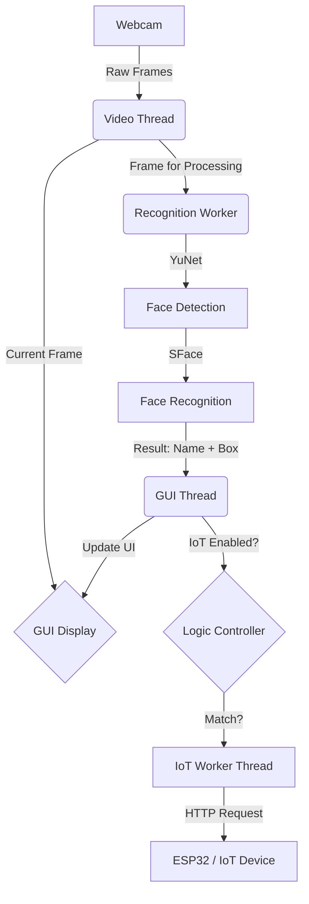

# System Architecture | สถาปัตยกรรมระบบ

## 📌 Overview | ภาพรวมข้อมูล
[EN] The system is designed to be highly responsive by separating specialized tasks into different threads.
[TH] ระบบถูกออกแบบมาให้มีการตอบสนองที่รวดเร็วโดยการแยกงานเฉพาะทางออกเป็นหลาย Thread

## 📊 Component Diagram | แผนผังองค์ประกอบ

## 🔄 Threading Model | รูปแบบการทำงานของ Thread
1.  **Main/GUI Thread**: [EN] Handles UI and user input. [TH] จัดการหน้าจอและการทำงานของผู้ใช้
2.  **Video Thread**: [EN] Fetches frames at 30 FPS. [TH] ดึงภาพจากกล้องที่ความเร็ว 30 FPS
3.  **Recognition Worker**: [EN] Runs AI models (YuNet/SFace) asynchronously. [TH] ประมวลผลโมเดล AI แบบขนาน
4.  **IoT Worker**: [EN] Handles network requests to ESP32. [TH] จัดการการส่งข้อมูลไปยัง ESP32

## 🛠️ Technology Stack | เทคโนโลยีที่ใช้
- **Language**: Python 3.12/3.13
- **Graphics**: PyQt6
- **Computer Vision**: OpenCV (DNN Module)
- **AI Models**: YuNet (Detection) & SFace (Recognition)
