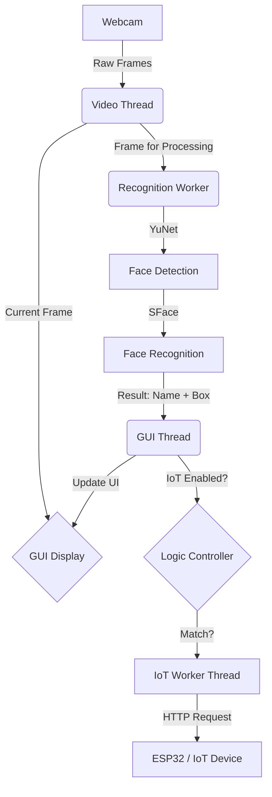

# System Architecture

## Overview
The system is designed to be highly responsive by separating specialized tasks into different threads. This prevents the Graphical User Interface (GUI) from freezing during heavy AI computation.

## Component Diagram

## Threading Model
1.  **Main/GUI Thread**: Handles user input, drawing video frames, and managing sub-windows.
2.  **Video Capture Thread**: Continuously fetches frames from the camera at ~30 FPS.
3.  **Recognition Worker**: Runs the AI models (YuNet/SFace). It processes frames asynchronously to maintain high frame rates in the display.
4.  **IoT Background Thread**: Handles WiFi/HTTP requests to avoid network latency affecting the GUI responsiveness.

## Technology Stack
- **Language**: Python 3.12/3.13
- **Graphics**: PyQt6
- **Computer Vision**: OpenCV (DNN Module)
- **AI Models**: 
    - YuNet (Face Detection)
    - SFace (Face Recognition / Embeddings)
