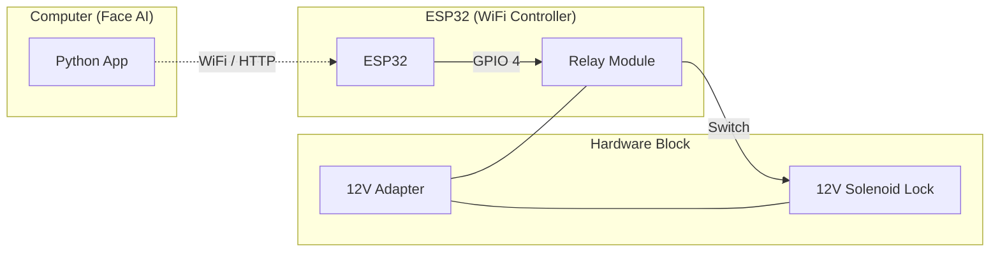

# IoT Hardware & ESP32 Integration | ฮาร์ดแวร์ IoT และการเชื่อมต่อ ESP32

[EN] This guide explains how to set up the ESP32 hardware to work with the Python Face Recognition system.
[TH] คู่มือนี้อธิบายวิธีการตั้งค่าฮาร์ดแวร์ ESP32 เพื่อใช้งานร่วมกับระบบจดจำใบหน้า

---

## 🛠️ Required Components | อุปกรณ์ที่จำเป็น
- **ESP32 Development Board** (e.g., ESP32-WROOM-32)
- **Relay Module** (5V or 3.3V Trigger)
- **12V Solenoid Door Lock**
- **External 12V Power Supply** (for the lock)
- **Jumper Wires**

## 🔌 Wiring Diagram | แผนผังการต่อวงจร


## 💻 ESP32 Source Code (Arduino IDE) | ซอร์สโค้ด ESP32
[EN] Copy this code to your Arduino IDE, update your WiFi credentials, and upload it to your ESP32.
[TH] คัดลอกโค้ดนี้ไปยัง Arduino IDE แก้ไขข้อมูล WiFi และอัปโหลดไปยัง ESP32

```cpp
#include <WiFi.h>
#include <WebServer.h>

const char* ssid = "YOUR_WIFI_SSID";
const char* password = "YOUR_WIFI_PASSWORD";

WebServer server(80);
const int relayPin = 4; // GPIO Pin connected to Relay

void handleUnlock() {
  Serial.println("Unlock Triggered!");
  digitalWrite(relayPin, LOW); // Trigger Relay (Active Low)
  server.send(200, "text/plain", "Unlocked");
  
  delay(3000); // Keep unlocked for 3 seconds
  
  digitalWrite(relayPin, HIGH); // Lock again
  Serial.println("Locked");
}

void setup() {
  Serial.begin(115200);
  pinMode(relayPin, OUTPUT);
  digitalWrite(relayPin, HIGH); // Default Locked

  WiFi.begin(ssid, password);
  while (WiFi.status() != WL_CONNECTED) {
    delay(500);
    Serial.print(".");
  }

  Serial.println("\nWiFi Connected!");
  Serial.print("IP Address: ");
  Serial.println(WiFi.localIP());

  server.on("/unlock", handleUnlock);
  server.begin();
}

void loop() {
  server.handleClient();
}
```

## ⚙️ Configuration | การตั้งค่า
1. [EN] Note the **IP Address** shown in the Arduino Serial Monitor.
   [TH] จดจำสถานะ **IP Address** ที่แสดงใน Serial Monitor ของ Arduino
2. [EN] Open the Python GUI and enter the IP in the **IoT / WiFi Control** panel.
   [TH] เปิดโปรแกรม Python GUI และระบุ IP ในแผงควบคุม **IoT / WiFi Control**
3. [EN] Enable the **IoT Trigger**.
   [TH] เปิดใช้งาน **IoT Trigger**
